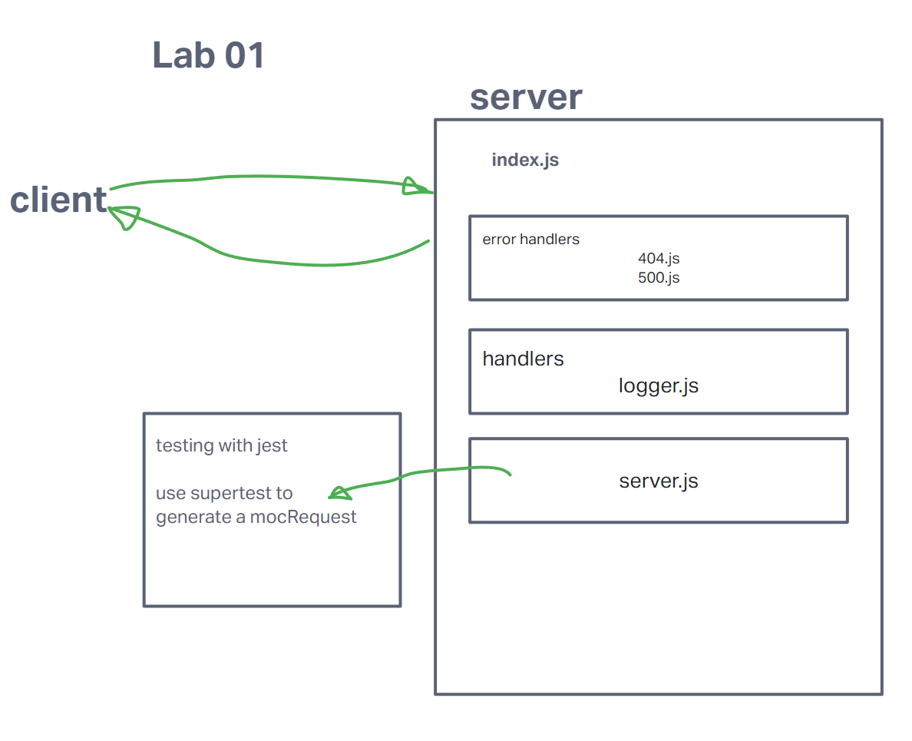

LAB - Class 01

Project: Server Deployment Practice

Author: Steve Gant

Problem Domain
Basic server deployment

Links and Resources
  - [GitHub Actions ci/cd](https://github.com/stevengant/server-deployment-practice/actions)
  - [back-end server url](https://server-deployment-practice-gv7p.onrender.com)

Setup
.env requirements (where applicable)
for now I have none and do not require one

How to initialize/run your application (where applicable)
 - nodemon
How to use your library (where applicable)
Features / Routes
Feature One: Details of feature
GET : /hello - specific route to hit
Tests
How do you run tests?
Any tests of note?
 - none

UML
